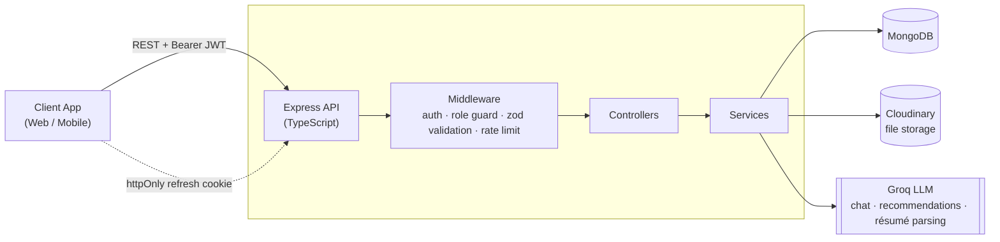

<div align="center">

# 🌉 TalentBridge — Server

### AI-powered job board & talent platform API

Connecting **job seekers** and **employers** with a smart, secure, role-based backend — featuring an AI career assistant, AI résumé parsing, and AI job recommendations.

[](https://nodejs.org/)
[](https://expressjs.com/)
[](https://www.typescriptlang.org/)
[](https://www.mongodb.com/)
[](https://jwt.io/)
[](https://groq.com/)
[](https://server-talentbridge.onrender.com)

[](https://server-talentbridge.onrender.com/health)


[**🚀 Live API**](https://server-talentbridge.onrender.com) · [**📮 Health Check**](https://server-talentbridge.onrender.com/health) · [**🐛 Report a Bug**](https://github.com/SinghRohan333/server-talentbridge/issues)

</div>

---

## 📋 Table of Contents

- [About](#-about)
- [Features](#-features)
- [Tech Stack](#-tech-stack)
- [Architecture](#-architecture)
- [Project Structure](#-project-structure)
- [API Reference](#-api-reference)
- [Environment Variables](#-environment-variables)
- [Getting Started](#-getting-started)
- [Security](#-security)
- [Deployment](#-deployment)
- [Roadmap](#-roadmap)
- [Contributing](#-contributing)
- [License](#-license)
- [Author](#-author)

---

## 📖 About

**TalentBridge** is a production-grade REST API powering a full talent-acquisition platform — think a lightweight LinkedIn Jobs / Indeed clone. It supports three roles out of the box (**job seeker**, **employer**, **admin**) and layers genuine AI features on top of a solid, type-safe Express + MongoDB foundation:

- An **AI career assistant** that can search jobs, pull job details, and check application/saved-job status on a seeker's behalf, in natural conversation.
- **AI résumé parsing** that reads uploaded PDF/DOCX résumés and extracts structured, usable data.
- **AI-powered job recommendations** built from a seeker's real interaction signals — views, applications, and saved jobs — not just keyword matching.

The API is written entirely in **TypeScript** on **Express 5**, talks to **MongoDB** through the native driver (no ODM overhead), and is currently deployed on **Render**.

---

## ✨ Features

<table>
<tr>
<td valign="top" width="50%">

### 👤 Job Seekers
- Register/login with email & password or **Google OAuth**
- Browse, search & filter jobs (category, type, location, salary, experience level)
- Save jobs for later
- Apply with a cover letter + résumé
- Track application status in a personal dashboard
- Upload a résumé and get it **AI-parsed** automatically
- Get **AI-generated job recommendations** tailored to their activity
- Chat with an **AI career assistant** to search jobs conversationally

</td>
<td valign="top" width="50%">

### 🏢 Employers
- Post, edit, and close job listings
- View and manage all applicants per job
- Update application status (reviewed / shortlisted / rejected / accepted)
- Employer analytics dashboard (views, applications, active listings)

### 🛡️ Admins
- Platform-wide stats dashboard
- Manage users (activate / deactivate / delete)
- Moderate job listings (flag / unflag / delete)

</td>
</tr>
</table>

### 🤖 AI Layer (powered by [Groq](https://groq.com/))
| Feature | What it does |
|---|---|
| **Career Assistant** | Tool-calling chat agent that searches live job data to answer seeker questions |
| **Résumé Parsing** | Extracts text from PDF/DOCX résumés (`pdf-parse`, `mammoth`) and structures it |
| **Smart Recommendations** | Scores and caches personalized job matches from real behavioral signals |

### 🌐 Platform-wide
- 🔐 JWT auth with **access + refresh token rotation**
- 🚦 Endpoint-level **rate limiting** (auth, AI, contact, newsletter)
- ✅ Full request **validation with Zod** (body & query)
- ☁️ **Cloudinary**-backed file uploads via Multer
- 📬 Contact form & newsletter subscription endpoints
- 📊 Public + role-scoped stats endpoints
- ❤️ `/health` endpoint for uptime monitoring

---

## 🛠 Tech Stack

| Layer | Technology |
|---|---|
| **Runtime** | Node.js |
| **Framework** | Express 5 |
| **Language** | TypeScript |
| **Database** | MongoDB (native driver, no ODM) |
| **Auth** | JWT (access + refresh) · bcryptjs · Google OAuth (`google-auth-library`) |
| **Validation** | Zod |
| **File Storage** | Cloudinary + Multer |
| **AI / LLM** | Groq SDK |
| **Résumé Parsing** | `pdf-parse`, `mammoth` |
| **Security** | `express-rate-limit`, `cors`, `cookie-parser`, httpOnly cookies |
| **Dev Tooling** | `tsx` (dev watch), `tsc` (build) |
| **Deployment** | Render |

---

## 🏗 Architecture



Requests flow through **route → middleware (auth / role / validation / rate-limit) → controller → service → MongoDB**, keeping HTTP concerns, business logic, and data access cleanly separated.

---

## 📁 Project Structure

```
server-talentbridge/
├── src/
│   ├── config/          # env validation, MongoDB connection, Cloudinary, Multer
│   ├── controllers/     # request/response handlers (one per resource)
│   ├── middleware/      # auth, role guard, zod validation, error handler
│   ├── routes/          # Express routers, one per resource
│   ├── services/        # business logic + MongoDB queries
│   │   └── ai/          # Groq client, chat agent + tools, recommendations, résumé parsing
│   ├── types/           # shared TypeScript models (User, Job, Application, ...)
│   ├── utils/           # helpers (e.g. asyncHandler)
│   ├── validators/      # Zod schemas
│   └── index.ts         # app entrypoint
├── package.json
└── tsconfig.json
```

---

## 📡 API Reference

**Base URL (production):** `https://server-talentbridge.onrender.com`
**Base URL (local):** `http://localhost:5000`

All protected routes require `Authorization: Bearer <accessToken>`. 🔒 = auth required · 🎭 = role-restricted.

<details>
<summary><strong>🔑 Auth — <code>/api/auth</code></strong></summary>

| Method | Endpoint | Access | Description |
|---|---|---|---|
| `POST` | `/register` | Public | Register a new seeker or employer |
| `POST` | `/login` | Public | Log in with email & password |
| `POST` | `/google` | Public | Log in / sign up with Google OAuth |
| `POST` | `/refresh` | Public (cookie) | Rotate access token via refresh cookie |
| `POST` | `/logout` | 🔒 | Invalidate refresh tokens |
| `GET` | `/me` | 🔒 | Get the current authenticated user |

</details>

<details>
<summary><strong>💼 Jobs — <code>/api/jobs</code></strong></summary>

| Method | Endpoint | Access | Description |
|---|---|---|---|
| `GET` | `/` | Public | List/search jobs with filters |
| `GET` | `/mine` | 🔒🎭 employer | Jobs posted by the current employer |
| `GET` | `/meta/filters` | Public | Available filter options |
| `GET` | `/meta/categories` | Public | Job counts by category |
| `GET` | `/:id` | Public | Get a single job's details |
| `POST` | `/` | 🔒🎭 employer | Create a job listing |
| `PATCH` | `/:id` | 🔒🎭 employer/admin | Update a job listing |
| `DELETE` | `/:id` | 🔒🎭 employer/admin | Delete a job listing |

</details>

<details>
<summary><strong>⭐ Saved Jobs — <code>/api/saved-jobs</code></strong> (🔒🎭 seeker)</summary>

| Method | Endpoint | Description |
|---|---|---|
| `GET` | `/` | List saved jobs |
| `POST` | `/:jobId` | Save a job |
| `DELETE` | `/:jobId` | Remove a saved job |

</details>

<details>
<summary><strong>📝 Applications — <code>/api/applications</code></strong> (🔒)</summary>

| Method | Endpoint | Access | Description |
|---|---|---|---|
| `GET` | `/mine` | 🎭 seeker | My applications |
| `POST` | `/:jobId` | 🎭 seeker | Apply to a job |
| `GET` | `/job/:jobId` | 🎭 employer | Applicants for a job |
| `PATCH` | `/:id/status` | 🎭 employer | Update an application's status |

</details>

<details>
<summary><strong>👤 Users — <code>/api/users</code></strong> (🔒)</summary>

| Method | Endpoint | Access | Description |
|---|---|---|---|
| `PATCH` | `/profile` | Any role | Update profile |
| `GET` | `/dashboard/seeker` | 🎭 seeker | Seeker dashboard summary |
| `POST` | `/resume` | 🎭 seeker | Upload & AI-parse a résumé (PDF/DOCX) |

</details>

<details>
<summary><strong>🤖 AI Recommendations — <code>/api/recommendations</code></strong> (🔒🎭 seeker)</summary>

| Method | Endpoint | Description |
|---|---|---|
| `GET` | `/` | Cached, personalized AI job recommendations |

</details>

<details>
<summary><strong>💬 AI Chat — <code>/api/chat</code></strong> (🔒🎭 seeker)</summary>

| Method | Endpoint | Description |
|---|---|---|
| `GET` | `/latest` | Get the latest conversation |
| `POST` | `/message` | Send a message to the AI career assistant |

</details>

<details>
<summary><strong>📊 Stats — <code>/api/stats</code></strong></summary>

| Method | Endpoint | Access | Description |
|---|---|---|---|
| `GET` | `/public` | Public | Platform-wide public stats |
| `GET` | `/employer/dashboard` | 🔒🎭 employer | Employer analytics dashboard |

</details>

<details>
<summary><strong>🛡️ Admin — <code>/api/admin</code></strong> (🔒🎭 admin)</summary>

| Method | Endpoint | Description |
|---|---|---|
| `GET` | `/stats` | Platform admin stats |
| `GET` | `/users` | List/filter users |
| `PATCH` | `/users/:id/status` | Activate/deactivate a user |
| `DELETE` | `/users/:id` | Delete a user |
| `GET` | `/jobs` | List/filter all jobs |
| `PATCH` | `/jobs/:id/flag` | Flag a job |
| `PATCH` | `/jobs/:id/unflag` | Unflag a job |
| `DELETE` | `/jobs/:id` | Delete a job |

</details>

<details>
<summary><strong>✉️ Newsletter & Contact</strong></summary>

| Method | Endpoint | Description |
|---|---|---|
| `POST` | `/api/newsletter` | Subscribe to the newsletter |
| `POST` | `/api/contact` | Submit a contact form message |

</details>

<details>
<summary><strong>❤️ Health</strong></summary>

| Method | Endpoint | Description |
|---|---|---|
| `GET` | `/health` | Uptime/health check — returns status + timestamp |

</details>

---

## 🔧 Environment Variables

Create a `.env` file in the project root:

```env
# Server
PORT=5000
NODE_ENV=development
CLIENT_ORIGIN=http://localhost:3000

# Database
MONGODB_URI=your_mongodb_connection_string
MONGODB_DB_NAME=talentbridge

# JWT (must be 32+ characters)
JWT_ACCESS_SECRET=your_access_token_secret
JWT_REFRESH_SECRET=your_refresh_token_secret
JWT_ACCESS_EXPIRES_IN=15m
JWT_REFRESH_EXPIRES_IN=7d

# Google OAuth (optional)
GOOGLE_CLIENT_ID=
GOOGLE_CLIENT_SECRET=
GOOGLE_REDIRECT_URI=

# Cloudinary — required for file uploads (optional)
CLOUDINARY_CLOUD_NAME=
CLOUDINARY_API_KEY=
CLOUDINARY_API_SECRET=

# Groq — required for AI chat, recommendations & résumé parsing (optional)
GROQ_API_KEY=
```

| Variable | Required | Default | Notes |
|---|:---:|---|---|
| `PORT` | No | `5000` | |
| `NODE_ENV` | No | `development` | `development` \| `production` \| `test` |
| `CLIENT_ORIGIN` | ✅ | — | Frontend origin allowed by CORS |
| `MONGODB_URI` | ✅ | — | MongoDB connection string |
| `MONGODB_DB_NAME` | ✅ | — | Database name |
| `JWT_ACCESS_SECRET` | ✅ | — | Min. 32 characters |
| `JWT_REFRESH_SECRET` | ✅ | — | Min. 32 characters |
| `JWT_ACCESS_EXPIRES_IN` | No | `15m` | |
| `JWT_REFRESH_EXPIRES_IN` | No | `7d` | |
| `GOOGLE_CLIENT_ID` / `SECRET` / `REDIRECT_URI` | Optional | — | Needed for `/api/auth/google` |
| `CLOUDINARY_*` | Optional | — | Needed for résumé/logo uploads |
| `GROQ_API_KEY` | Optional | — | Needed for chat, recommendations & résumé parsing |

Environment variables are validated at startup with **Zod** — the app fails fast with a clear error if anything required is missing.

---

## 🚀 Getting Started

### Prerequisites
- Node.js 18+
- A MongoDB instance (local or [Atlas](https://www.mongodb.com/atlas))

### Installation

```bash
# 1. Clone the repo
git clone https://github.com/SinghRohan333/server-talentbridge.git
cd server-talentbridge

# 2. Install dependencies
npm install

# 3. Set up environment variables
cp .env.example .env   # then fill in your values (see table above)

# 4. Run in development (hot reload)
npm run dev
```

The API will start at `http://localhost:5000` — check it's alive at `http://localhost:5000/health`.

### Scripts

| Command | Description |
|---|---|
| `npm run dev` | Start the dev server with hot reload (`tsx watch`) |
| `npm run build` | Compile TypeScript to `dist/` |
| `npm start` | Run the compiled production build |

---

## 🔐 Security

- **JWT access + refresh tokens** — short-lived access token returned in the response body; refresh token stored in an **httpOnly, `secure`, `sameSite`-protected cookie**, scoped to `/api/auth` and rotated on every refresh.
- **Password hashing** with `bcryptjs`.
- **Role-based access control** (`seeker` / `employer` / `admin`) enforced per-route.
- **Rate limiting** on auth, AI, contact, and newsletter endpoints to prevent abuse.
- **Schema validation** on every request body and query string via **Zod** — invalid input never reaches business logic.
- **CORS locked** to a single configured client origin with credentials support.

---

## ☁️ Deployment

The API is deployed on **[Render](https://render.com)**:

🔗 **Live:** [server-talentbridge.onrender.com](https://server-talentbridge.onrender.com)

> ⏳ **Note:** This runs on Render's free tier, so the service spins down when idle. The first request after inactivity may take **30–60 seconds** to respond while the instance wakes up — subsequent requests are fast.

**Build command:** `npm run build` · **Start command:** `npm start`

---

## 🗺 Roadmap

- [x] Auth (email/password + Google OAuth) with refresh token rotation
- [x] Job posting, search, and filtering
- [x] Applications & saved jobs
- [x] Employer & admin dashboards
- [x] AI résumé parsing
- [x] AI job recommendations
- [x] AI career assistant chat
- [ ] WebSocket-based real-time notifications
- [ ] Automated test suite (unit + integration)
- [ ] API documentation via Swagger/OpenAPI
- [ ] Dockerized local dev environment

---

## 🤝 Contributing

Contributions are welcome!

1. Fork the repo
2. Create a feature branch (`git checkout -b feature/amazing-feature`)
3. Commit your changes (`git commit -m "Add amazing feature"`)
4. Push to the branch (`git push origin feature/amazing-feature`)
5. Open a Pull Request

---

## 📄 License

This project is licensed under the **MIT License**. Add a `LICENSE` file to the repo root to make this official.

---

## 👨‍💻 Author

**Rohan Singh**

[](https://github.com/SinghRohan333)

<div align="center">

If you found this project useful, consider giving it a ⭐!

</div>
